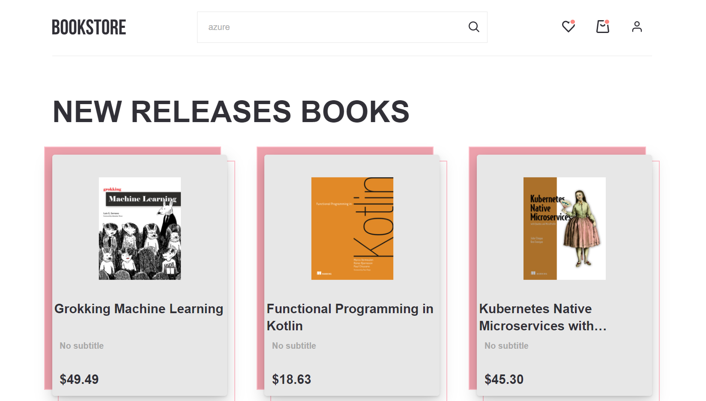

<div id="top"></div>
<br />
<div align="center">
<h1 align="center">
    Bookstore
     </h1>
    <h3 align="center">
    <a href="https://varvara-kravtsova.github.io/Bookstore/">Live Demo</a>
     </h3>
</div>

---

### About The Project

<br/>
<br/>

Bookstore is a platform for buying books, where you can get information about the book, add the book you like to your favorites and to the cart. <br/> You can also search for books by title, subtitle, author and ISBN.

<p align="right">(<a href="#top">back to top</a>)</p>

---

### Usage

User ability:

- Registration
- Authorization
- Change username and email
- Search books
- Add books to favorites or remove them
- Add books to the cart (or remove them) and see total price
- Watch book preview pdf

Search by:

- Title
- Subtitle
- Author
- ISBN

<p align="right">(<a href="#top">back to top</a>)</p>

---

### Installation

1. Get a free API at [IT Bookstore API](https://api.itbook.store/)
2. Register on [Firebase](https://firebase.google.com/), create your data base and copy Firebase configuration
3. Clone the repo
   ```sh
   git clone https://github.com/Varvara-Kravtsova/Bookstore.git
   ```
4. Install NPM packages
   ```sh
   npm install
   ```
5. Enter your API in `bookService`

   ```js
   private readonly API_URL = "API";
   ```

6. Enter your Firebase configuration in "firebase.js"

   ```js
   const firebaseConfig = {"your Firebase configuration"};
   ```

<p align="right">(<a href="#top">back to top</a>)</p>

---

### Tools and packages

- [React](https://reactjs.org/)
- [Redux Toolkit](https://redux-toolkit.js.org/)
- [Typescript](https://www.typescriptlang.org/)
- [Styled Сomponents](https://styled-components.com/)
- [React Router](https://reactrouter.com/)
- [React Router Dom](https://www.npmjs.com/package/react-router-dom)
- [React Hook Form](https://react-hook-form.com/)
- [Axios](https://axios-http.com/docs/intro)
- [Firebase](https://firebase.google.com/)
- [React-Loading](https://www.npmjs.com/package/react-loading?ref=hackernoon.com)
- [React-Scroll](https://www.npmjs.com/package/react-scroll)
- [React-Uuid](https://www.npmjs.com/package/uuid)
- [gh-pages](https://pages.github.com/)

<p align="right">(<a href="#top">back to top</a>)</p>
